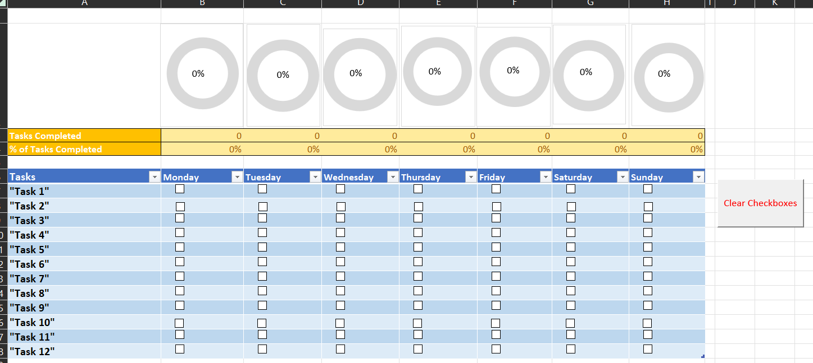
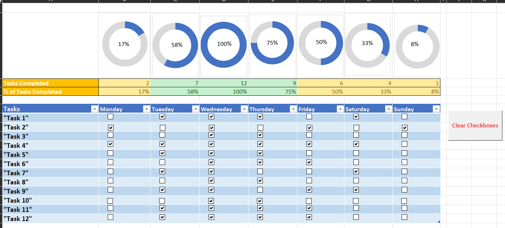

# Excel_Projects
Excel feature exploration

##  Task Management Tool
Created task management tool in Excel using checklists, conditional formatting, countif statements, and conditional formatting.

Tasks are chosen by the user. As the user completes the tasks, checkboxes are checked. As checkboxes are checked, the "Tasks Completed" section increments by one for each checkbox and the "% of Tasks Completed" section also increases. If more than 6 tasks out of the 12 are completed, the sections turn green.

The doughnut chart is connected to the "% of Tasks Completed" section and the blue section and corresponding percentage increases as more checkboxes are checked.

A "Clear Checkboxes" button was made with VBA script to be clicked on so all the checkboxes can be quickly cleared at once.

The following screenshots show what the sheet looks like before and after being used.

